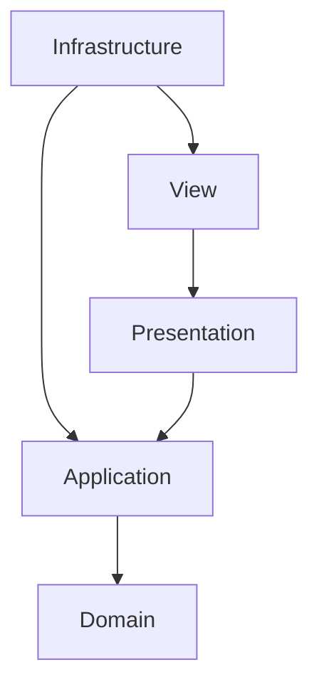

# Architectural Refactoring Skill

This skill guides the AI agent through refactoring the codebase to enforce clean architecture layer separation and keep the output binary within the 1.44MB target limit.

## Architectural Integrity Check

Ensure that dependencies flow inwards according to the following rules:

1. **Domain Layer**:
   * Must NOT include any headers from other layers (Application, Presentation, View, Infrastructure).
   * Must NOT contain platform-specific code (Win32, DirectX 12, etc.).
   * Should contain raw data structures and core game rules.
2. **Application Layer**:
   * Can depend on the **Domain** layer.
   * Can define interfaces (abstract classes) to decouple from the Infrastructure layer.
   * Must NOT depend on the **Presentation**, **View**, or **Infrastructure** layers directly.
3. **Presentation Layer**:
   * Acts as the bridge between **Application** and **View**.
   * Can depend on **Application** to read state, and format data for rendering.
4. **View Layer**:
   * Can depend on **Presentation** and **Infrastructure** (e.g. rendering device).
   * Responsible for rendering entities and drawing the UI.
5. **Infrastructure Layer**:
   * Implements interfaces defined in the **Application** or **View** layers.
   * Directly interacts with Win32 API, DirectX 12, or OS APIs.

## Refactoring Process

Follow these steps when performing a refactoring task:

### Step 1: Dependency Analysis
* Scan all `#include` directives in modified files.
* Confirm that no files violate the architectural direction:
  * Check for cross-layer references (e.g., Domain importing Presentation).
  * Use forward declarations in header files where possible to reduce dependencies.

### Step 2: Binary Size Optimization (1.44MB Constraint)
* Minimize the inclusion of heavy C++ Standard Library headers (like `<iostream>`, `<regex>`, `<sstream>`) in headers. Prefer `<algorithm>`, `<vector>`, or lightweight custom implementations if binary size exceeds the limit.
* Avoid excessive template instantiation or heavy RTTI (`dynamic_cast`) and Exception Handling (`try-catch`) if it increases executable overhead.
* Prefer inline functions for tiny utility methods to allow compiler optimization, but avoid `inline` on large functions.

### Step 3: Code Health & Readability
* Consolidate duplicate math functions or physics calculations.
* Ensure consistent use of `nullptr` instead of `NULL` or `0`.
* Ensure that all dynamic memory allocations (if any) are properly managed or avoided altogether by using stack allocation/static pools.

### Step 4: Verification
* Build the game.
* Check the output size of the executable to ensure it is well within the 1.44MB limit.
