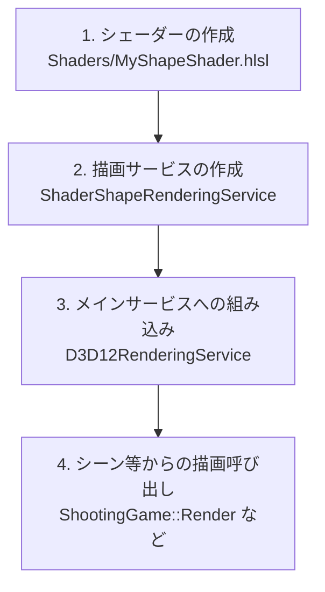

# シェーダーによる図形描画ワークフロー (別クラスカプセル化パターン)

現在の DirectX 12 描画システムにおいて、[TextRenderingService](file:///D:/PandD/FloppyDiskShootingGame/Infrastructure/ExternalServices/TextRenderingService.h) のように、**シェーダーのコンパイル、PSO（パイプラインステートオブジェクト）の構築、描画コマンドの実行を別クラスにカプセル化する設計パターン**のワークフローをまとめます。

この設計にすることで、[D3D12RenderingService](file:///D:/PandD/FloppyDiskShootingGame/Infrastructure/ExternalServices/D3D12RenderingService.h) 自体のコードを汚さずに、新しいシェーダー描画ロジックを独立して追加・変更することができます。

---

## ワークフローの全体像

以下の 4 つのステップで別クラスとしてのシェーダー描画サービスを追加します。



---

## 1. シェーダーコードの作成 (Shaders フォルダ)

[Shaders](file:///D:/PandD/FloppyDiskShootingGame/Shaders) フォルダに新しい HLSL ファイルを作成します。

> [!NOTE]
> 最終的なビルドサイズ制限（1.44MB）をクリアするため、本番ビルド時にはシェーダーコードをC++ソースファイル内に文字列（ヘッダ等）として直接埋め込む（インライン化する）手法が基本となります。ただし、開発中の編集のしやすさや視認性（シンタックスハイライト等）を考慮し、本ワークフローでは分かりやすさのために個別のシェーダーファイル（`.hlsl`）を作成して読み込む手順で解説しています。

**例：`Shaders/MyShapeShader.hlsl`**
```hlsl
struct VS_OUTPUT
{
    float4 pos : SV_Position;
    float2 uv : TEXCOORD0;
};

cbuffer TransformBuffer : register(b0)
{
    float2 u_position;      // 画面上の中心座標 (NDC: -1.0 ~ 1.0)
    float2 u_size;          // サイズ (W, H)
    float4 u_color;         // 色 (RGBA)
    float  u_time;          // 時間
};

// 頂点シェーダー (頂点バッファを使わずに4頂点の矩形を生成)
VS_OUTPUT VSMain(uint vID : SV_VertexID)
{
    VS_OUTPUT output;
    
    // vID から (-1.0, 1.0) の頂点座標を計算
    float2 localPos;
    localPos.x = (float)(vID & 2) - 1.0f;
    localPos.y = (float)((vID & 1) << 1) - 1.0f;

    float2 finalPos = u_position + (localPos * u_size);
    output.pos = float4(finalPos, 0.0f, 1.0f);
    output.uv = localPos; // 範囲は [-1.0, 1.0]

    return output;
}

// ピクセルシェーダー (SDFによる円の描画)
float4 PSMain(VS_OUTPUT input) : SV_Target
{
    float d = length(input.uv);
    float alpha = smoothstep(0.8, 0.78, d);
    
    if (alpha < 0.01) discard; // 描画範囲外を切り抜く

    // 時間による明滅
    float pulse = sin(u_time * 0.05) * 0.1 + 0.9;
    return float4(u_color.rgb * pulse, alpha * u_color.a);
}
```

---

## 2. 描画サービスの作成 (Infrastructure/ExternalServices フォルダ)

新規クラス `ShaderShapeRenderingService` を定義します。

### ① [ShaderShapeRenderingService.h](file:///D:/PandD/FloppyDiskShootingGame/Infrastructure/ExternalServices/ShaderShapeRenderingService.h) の作成
```cpp
#pragma once
#include <d3d12.h>
#include <wrl/client.h>
#include <DirectXMath.h>
#include <dxgiformat.h>

using Microsoft::WRL::ComPtr;

class ShaderShapeRenderingService {
public:
    ShaderShapeRenderingService() = default;
    ~ShaderShapeRenderingService() = default;

    // 初期化 (D3D12RenderingService から Device と BackBufferFormat を受け取る)
    bool Initialize(ID3D12Device* device, DXGI_FORMAT rtvFormat);

    // 描画実行
    void RenderShape(
        ID3D12GraphicsCommandList* commandList,
        D3D12_GPU_VIRTUAL_ADDRESS cbvGpuAddress,
        void* cbvCpuPtr,
        DirectX::XMFLOAT2 position,
        DirectX::XMFLOAT2 size,
        DirectX::XMFLOAT4 color,
        float time
    );

private:
    ComPtr<ID3D12RootSignature> m_rootSignature;
    ComPtr<ID3D12PipelineState> m_pipelineState;

    // 定数バッファの構造体 (HLSL側の TransformBuffer と一致させる)
    struct ShapeConstantBufferData {
        DirectX::XMFLOAT2 u_position;
        DirectX::XMFLOAT2 u_size;
        DirectX::XMFLOAT4 u_color;
        float             u_time;
        float             u_pad[3]; // 16バイト境界アライメント用
    };

    bool InitPipeline(ID3D12Device* device, DXGI_FORMAT rtvFormat);
};
```

### ② [ShaderShapeRenderingService.cpp](file:///D:/PandD/FloppyDiskShootingGame/Infrastructure/ExternalServices/ShaderShapeRenderingService.cpp) の作成
```cpp
#include "ShaderShapeRenderingService.h"
#include <d3dcompiler.h>
#include <string>

// .exeが存在する絶対パスを基準にシェーダーファイルへのフルパスを解決する外部ヘルパー関数
extern std::wstring GetShaderFilePath(const wchar_t* fileName);

bool ShaderShapeRenderingService::Initialize(ID3D12Device* device, DXGI_FORMAT rtvFormat) {
    return InitPipeline(device, rtvFormat);
}

bool ShaderShapeRenderingService::InitPipeline(ID3D12Device* device, DXGI_FORMAT rtvFormat) {
    // 1. ルートシグネチャの定義 (定数バッファ b0 のみ)
    D3D12_ROOT_PARAMETER rootParameters[1] = {};
    rootParameters[0].ParameterType = D3D12_ROOT_PARAMETER_TYPE_CBV;
    rootParameters[0].Descriptor.ShaderRegister = 0;
    rootParameters[0].ShaderVisibility = D3D12_SHADER_VISIBILITY_ALL;

    D3D12_ROOT_SIGNATURE_DESC rootSigDesc = {};
    rootSigDesc.NumParameters = _countof(rootParameters);
    rootSigDesc.pParameters = rootParameters;
    rootSigDesc.Flags = D3D12_ROOT_SIGNATURE_FLAG_ALLOW_INPUT_ASSEMBLER_INPUT_LAYOUT;

    ComPtr<ID3DBlob> signature;
    ComPtr<ID3DBlob> error;
    if (FAILED(D3D12SerializeRootSignature(&rootSigDesc, D3D_ROOT_SIGNATURE_VERSION_1, &signature, &error))) {
        return false;
    }
    if (FAILED(device->CreateRootSignature(0, signature->GetBufferPointer(), signature->GetBufferSize(), IID_PPV_ARGS(&m_rootSignature)))) {
        return false;
    }

    // 2. シェーダーファイルのコンパイル
    std::wstring path = GetShaderFilePath(L"Shaders\\MyShapeShader.hlsl");
    
    ComPtr<ID3DBlob> vertexShader;
    error.Reset();
    if (FAILED(D3DCompileFromFile(path.c_str(), nullptr, nullptr, "VSMain", "vs_5_0", D3DCOMPILE_DEBUG | D3DCOMPILE_SKIP_OPTIMIZATION, 0, &vertexShader, &error))) {
        return false;
    }

    ComPtr<ID3DBlob> pixelShader;
    error.Reset();
    if (FAILED(D3DCompileFromFile(path.c_str(), nullptr, nullptr, "PSMain", "ps_5_0", D3DCOMPILE_DEBUG | D3DCOMPILE_SKIP_OPTIMIZATION, 0, &pixelShader, &error))) {
        return false;
    }

    // 3. Pipeline State (PSO) の作成
    D3D12_GRAPHICS_PIPELINE_STATE_DESC psoDesc = {};
    psoDesc.InputLayout = { nullptr, 0 };
    psoDesc.pRootSignature = m_rootSignature.Get();
    psoDesc.VS = { vertexShader->GetBufferPointer(), vertexShader->GetBufferSize() };
    psoDesc.PS = { pixelShader->GetBufferPointer(), pixelShader->GetBufferSize() };
    psoDesc.RasterizerState.FillMode = D3D12_FILL_MODE_SOLID;
    psoDesc.RasterizerState.CullMode = D3D12_CULL_MODE_NONE;
    psoDesc.RasterizerState.DepthClipEnable = TRUE;
    psoDesc.DepthStencilState.DepthEnable = FALSE;
    psoDesc.DepthStencilState.StencilEnable = FALSE;
    psoDesc.SampleMask = UINT_MAX;
    psoDesc.PrimitiveTopologyType = D3D12_PRIMITIVE_TOPOLOGY_TYPE_TRIANGLE;
    psoDesc.NumRenderTargets = 1;
    psoDesc.RTVFormats[0] = rtvFormat;
    psoDesc.SampleDesc.Count = 1;

    // アルファブレンド設定
    psoDesc.BlendState.RenderTarget[0] = {
        TRUE, FALSE,
        D3D12_BLEND_SRC_ALPHA, D3D12_BLEND_INV_SRC_ALPHA, D3D12_BLEND_OP_ADD,
        D3D12_BLEND_ONE, D3D12_BLEND_ZERO, D3D12_BLEND_OP_ADD,
        D3D12_LOGIC_OP_NOOP,
        D3D12_COLOR_WRITE_ENABLE_ALL,
    };

    if (FAILED(device->CreateGraphicsPipelineState(&psoDesc, IID_PPV_ARGS(&m_pipelineState)))) {
        return false;
    }

    return true;
}

void ShaderShapeRenderingService::RenderShape(
    ID3D12GraphicsCommandList* commandList,
    D3D12_GPU_VIRTUAL_ADDRESS cbvGpuAddress,
    void* cbvCpuPtr,
    DirectX::XMFLOAT2 position,
    DirectX::XMFLOAT2 size,
    DirectX::XMFLOAT4 color,
    float time
) {
    // 1. 定数バッファの更新 (16バイトアライメントされた領域へコピー)
    ShapeConstantBufferData cbData;
    cbData.u_position = position;
    cbData.u_size = size;
    cbData.u_color = color;
    cbData.u_time = time;

    memcpy(cbvCpuPtr, &cbData, sizeof(ShapeConstantBufferData));

    // 2. パイプラインとルートシグネチャの切り替え
    commandList->SetPipelineState(m_pipelineState.Get());
    commandList->SetGraphicsRootSignature(m_rootSignature.Get());

    // 3. 定数バッファビューの設定
    commandList->SetGraphicsRootConstantBufferView(0, cbvGpuAddress);

    // 4. トポロジと描画命令の発行 (4頂点による矩形描画)
    commandList->IASetPrimitiveTopology(D3D_PRIMITIVE_TOPOLOGY_TRIANGLESTRIP);
    commandList->DrawInstanced(4, 1, 0, 0);
}
```

---

## 3. メインサービスへの組み込み

[D3D12RenderingService](file:///D:/PandD/FloppyDiskShootingGame/Infrastructure/ExternalServices/D3D12RenderingService.h) が新規作成したサービスを保持し、インターフェースを提供します。

### ① [D3D12RenderingService.h](file:///D:/PandD/FloppyDiskShootingGame/Infrastructure/ExternalServices/D3D12RenderingService.h) の変更
クラス定義にサービスを追加し、呼び出し用の仲介関数を定義します。
```cpp
// D3D12RenderingService.h にインクルードを追加
#include "ShaderShapeRenderingService.h"

class D3D12RenderingService {
public:
    // ...

    // クライアント向けの簡便な呼び出し関数
    void RenderCustomShape(DirectX::XMFLOAT2 position, DirectX::XMFLOAT2 size, DirectX::XMFLOAT4 color, float time, int index);

private:
    // ...
    TextRenderingService m_textRenderer;
    ShaderShapeRenderingService m_shapeRenderer; // 【追加】シェーダー描画サービスを追加
    
    // ...
};
```

### ② [D3D12RenderingService.cpp](file:///D:/PandD/FloppyDiskShootingGame/Infrastructure/ExternalServices/D3D12RenderingService.cpp) の変更
初期化と中継関数を実装します。

```cpp
// D3D12RenderingService::Initialize 内で初期化
bool D3D12RenderingService::Initialize(HWND hwnd, int width, int height) {
    // ...
    DXGI_FORMAT rtvFormat = DXGI_FORMAT_R8G8B8A8_UNORM;
    if (m_renderTargets[0]) {
        rtvFormat = m_renderTargets[0]->GetDesc().Format;
    }
    
    // ... m_textRenderer の初期化

    // 【追加】新規サービスの初期化
    if (!m_shapeRenderer.Initialize(m_device.Get(), rtvFormat)) {
        return false;
    }

    return true;
}

// 【追加】中継関数の実装
void D3D12RenderingService::RenderCustomShape(DirectX::XMFLOAT2 position, DirectX::XMFLOAT2 size, DirectX::XMFLOAT4 color, float time, int index) {
    // 定数バッファのアライメント領域を算出
    D3D12_GPU_VIRTUAL_ADDRESS cbvGpuAddress = m_constantBuffer->GetGPUVirtualAddress() + index * 256;
    void* cbvCpuPtr = reinterpret_cast<char*>(m_cbvCpuData) + index * 256;

    m_shapeRenderer.RenderShape(
        m_commandList.Get(),
        cbvGpuAddress,
        cbvCpuPtr,
        position,
        size,
        color,
        time
    );
}
```

---

## 4. シーン等からの描画呼び出し

ゲームシーン（例: [TitleScene.cpp](file:///D:/PandD/FloppyDiskShootingGame/Presentation/Scenes/TitleScene.cpp) や [ShootingGame.h](file:///D:/PandD/FloppyDiskShootingGame/Temp/ShootingGame.h)）から呼び出します。

```cpp
// 描画カウント（定数バッファのインデックス）の制御を行いながら描画
int drawCount = 0;

// カスタムシェーダーで円を描画する
DirectX::XMFLOAT2 position = { 0.0f, 0.0f };
DirectX::XMFLOAT2 size = { 0.3f, 0.3f };
DirectX::XMFLOAT4 color = { 0.0f, 1.0f, 0.5f, 0.8f }; // 半透明の緑
float time = (float)spawnTimer;

renderer.RenderCustomShape(position, size, color, time, drawCount++);
```

---

## 設計上のポイント

1. **定数バッファのメモリ競合防止**
   * D3D12 では、同じフレーム内で同一の定数バッファ領域を別々の描画コールで上書きすると、描画データが崩れてしまいます。
   * そのため、`D3D12RenderingService::RenderCustomShape` では、引数として受け取る `index` を使用して `index * 256` バイトオフセットした独立したメモリ領域を各描画コマンドにバインドしています。これにより、同じフレーム内で複数の異なるカスタム形状を同時に描画することができます。
2. **ルートシグネチャとPSOの切り替えコスト**
   * `ShaderShapeRenderingService::RenderShape` の内部で `commandList->SetPipelineState` と `SetGraphicsRootSignature` を呼び出します。
   * D3D12ではステート切り替えのコストが発生するため、同じシェーダーの描画はできる限り連続して行うように描画順序を設計するとパフォーマンスが向上します。
3. **ディスク容量の制限とシェーダーの埋め込み**
   * 本プロジェクトの制約である「最終ビルドサイズ 1.44MB」を達成するためには、最終的にはシェーダーファイルを個別に配布するのではなく、C++ソースコード内に文字列として直接埋め込む（インライン化する）方法が基本となります。
   * インライン化を行う際は、[TextRenderingService.cpp](file:///D:/PandD/FloppyDiskShootingGame/Infrastructure/ExternalServices/TextRenderingService.cpp) の `g_textShaderCode` のように文字列リテラルとして定義し、`D3DCompile` を用いてメモリ上から直接コンパイルするように実装を変更してください。
